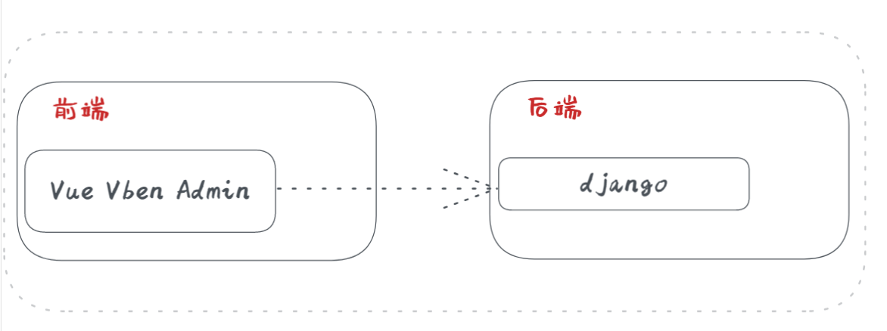

<div align="center"> <a href="https://github.com/anncwb/vue-vben-admin">  </a> <br> <br>

<h1>Vue ShopStore</h1>
</div>

## Introduction
本项目利用Vue Vben Admin作为项目前端，而利用django作为后台数据管理系统，实现前后端分离。
Vue Vben Admin is a free and open source middle and back-end template. Using the latest `vue3`, `vite2`, `TypeScript` and other mainstream technology development, the out-of-the-box middle and back-end front-end solutions can also be used for learning reference.而django作为python网页开发利器，使用其admin管理功能可以很方便地操作数据数据库。


## Feature
- **State of The Art Development**：Use front-end front-end technology development such as Vue3/vite2
- **TypeScript**: Application-level JavaScript language
- **Theming**: Configurable themes
- **International**：Built-in complete internationalization program
- **Authority** Built-in complete dynamic routing permission generation scheme.
- **Component** Multiple commonly used components are encapsulated twice
- **Django** 方便操作数据库，同时作为高效的网页框架，具有强大的性能。

## Preview
商品平铺展示页面如下：  
   

商品详情介绍页面如下：   


购物车页面如下：   


交易页面如下：   


订单页面如下：   

个人账户设置页面如下：


## Documentation

[前端文档](https://doc.vvbin.cn/)   
[后端文档](https://docs.djangoproject.com/zh-hans/4.2/)
## Preparation

- [node](http://nodejs.org/) and [git](https://git-scm.com/) - Project development environment
- [Vite](https://vitejs.dev/) - Familiar with vite features
- [Vue3](https://v3.vuejs.org/) - Familiar with Vue basic syntax
- [TypeScript](https://www.typescriptlang.org/) - Familiar with the basic syntax of `TypeScript`
- [Es6+](http://es6.ruanyifeng.com/) - Familiar with es6 basic syntax
- [Vue-Router-Next](https://next.router.vuejs.org/) - Familiar with the basic use of vue-router
- [Ant-Design-Vue](https://2x.antdv.com/docs/vue/introduce-cn/) - ui basic use
- [Mock.js](https://github.com/nuysoft/Mock) - mockjs basic syntax
- [Document](https://docs.djangoproject.com/zh-hans/4.2/) - django design source
## Install and use

- Get the project code

```bash
git clone https://github.com/DreamingWater/VueShopStore.git
```

- Installation dependencies

```bash
cd VueShopStore

pnpm install

```

- run

```bash
pnpm serve
```

- build

```bash
pnpm build
```

## Browser support

The `Chrome 80+` browser is recommended for local development

Support modern browsers, not IE

| [](http://godban.github.io/browsers-support-badges/)</br>IE | [](http://godban.github.io/browsers-support-badges/)</br>Edge | [](http://godban.github.io/browsers-support-badges/)</br>Firefox | [](http://godban.github.io/browsers-support-badges/)</br>Chrome | [](http://godban.github.io/browsers-support-badges/)</br>Safari |
| :-: | :-: | :-: | :-: | :-: |
| not support | last 2 versions | last 2 versions | last 2 versions | last 2 versions |


## License

[MIT © Vben-2020](./LICENSE)
